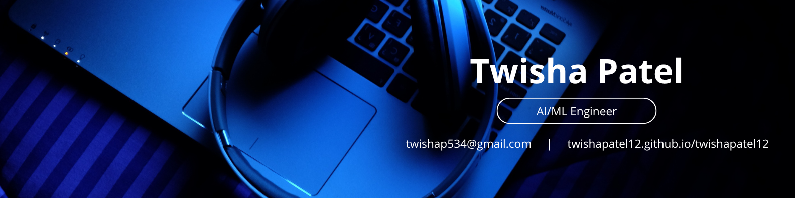

<!-- @format -->

<!-- Banner & Animated Headline -->

  

  

  

 

  
  
  
  

 

---

<h2 align="center" style="font-family:Montserrat,Segoe UI,Arial,sans-serif; font-size:32px; font-weight:800; color:#fff;">
  🛠️ Tech Stack Breakdown
</h2>

<h3 style="font-family:Montserrat,Segoe UI,Arial,sans-serif; font-size:25px; color:#3caee6; font-weight:700;">
  💻 Languages
</h3>

  
  
  
  

<ul>
  <li><b>Python:</b> Core for AI/ML, data science, and automation.</li>
  <li><b>JavaScript:</b> For dynamic web and UI projects.</li>
  <li><b>PHP & MySQL:</b> Backend and database for web applications.</li>
</ul>

<h3 style="font-family:Montserrat,Segoe UI,Arial,sans-serif; font-size:25px; color:#3caee6; font-weight:700;">
  🧠 AI / ML & Data
</h3>

  
  
  
  
  
  
  

<ul>
  <li><b>Object Detection:</b> Real-time solutions using MMDetection, OpenCV.</li>
  <li><b>LLMs:</b> Fine-tuning Flan-T5, prompt engineering for domain-specific Q&A.</li>
  <li><b>Computer Vision & NLP:</b> Building and deploying end-to-end AI pipelines.</li>
</ul>

<h3 style="font-family:Montserrat,Segoe UI,Arial,sans-serif; font-size:25px; color:#3caee6; font-weight:700;">
  🌐 Web & Tools
</h3>

  
  
  
  
  
  

<ul>
  <li><b>Web Tech:</b> HTML, CSS, Bootstrap, JavaScript.</li>
  <li><b>APIs:</b> FastAPI for ML deployment, Docker for reproducibility.</li>
  <li><b>DevOps:</b> Git, CI/CD (GitHub Actions).</li>
</ul>

---

<!-- Section Headings with Dim Blue and Emojis -->
<h2 align="center" style="font-family:Montserrat,Segoe UI,Arial,sans-serif; font-size:2.2em; color:#fff; margin-top:30px;">
  🚀 Featured Projects
</h2>

  <table width="100%" style="max-width:950px;">
    <thead>
      <tr>
        <th align="center" style="color:#a2bacc;">Project</th>
        <th align="center" style="color:#a2bacc;">Tech</th>
        <th align="center" style="color:#a2bacc;">Description</th>
      </tr>
    </thead>
    <tbody>
      <tr>
        <td align="center">
          
        </td>
        <td>Python, FastAPI, Streamlit, Sklearn</td>
        <td>End-to-end ML pipeline for model training, benchmarking, and deployment with web UI.</td>
      </tr>
      <tr>
        <td align="center">
          
        </td>
        <td>Python, OpenCV, MMDetection</td>
        <td>Real-time object detection on webcam video with bounding box overlays.</td>
      </tr>
      <tr>
        <td align="center">
          
        </td>
        <td>Python, TensorFlow, Keras, OpenCV</td>
        <td>CNN-based deep learning to classify traffic signs (GTSRB dataset).</td>
      </tr>
      <tr>
        <td align="center">
          
        </td>
        <td>Python, HuggingFace, Flan-T5</td>
        <td>Fine-tuned LLM for finance Q&A using prompt engineering.</td>
      </tr>
      <tr>
        <td align="center">
          
        </td>
        <td>Python, SpeechRecognition</td>
        <td>Desktop voice assistant for reminders, music, and smart commands.</td>
      </tr>
    </tbody>
  </table>

---

<h2 align="center" style="font-family:Montserrat,Segoe UI,Arial,sans-serif; font-size:2.2em; color:#fff;">
  🏆 Certifications
</h2>

  <table width="90%" align="center" style="border: none; max-width:650px;">
    <tr>
      <td align="right" width="42%">
        
      </td>
      <td align="left" width="58%">Mastered Linux essentials and shell scripting.</td>
    </tr>
    <tr><td colspan="2" height="8"></td></tr>
    <tr>
      <td align="right">
        
      </td>
      <td align="left">Learned the fundamentals of jQuery for web interactivity.</td>
    </tr>
    <tr><td colspan="2" height="8"></td></tr>
    <tr>
      <td align="right">
        
      </td>
      <td align="left">Analyzed web traffic and digital strategies using Similarweb.</td>
    </tr>
  </table>

---

<h2 align="center" style="font-family:Montserrat,Segoe UI,Arial,sans-serif; font-size:2.2em; color:#fff;">
  📅 My AI Journey
</h2>

  <table width="90%" align="center" style="border: none;">
    <tr>
      <td align="right" width="180px" valign="top"><b>2023</b></td>
      <td>Started with Python, web dev, and basic ML projects.</td>
    </tr>
    <tr><td colspan="2" height="10"></td></tr>
    <tr>
      <td align="right" width="180px" valign="top"><b>2024</b></td>
      <td>Explored deep learning, NLP, and LLMs; built voice assistant and AutoML pipeline.</td>
    </tr>
    <tr><td colspan="2" height="10"></td></tr>
    <tr>
      <td align="right" width="180px" valign="top"><b>2025</b></td>
      <td>Interned in AI/ML roles, built real-time object detection & finance LLMs, growing expertise in computer vision and GenAI.</td>
    </tr>
  </table>

---

<h2 align="center" style="font-family:Montserrat,Segoe UI,Arial,sans-serif; font-size:2.2em; color:#fff;">
  📬 Let's Connect
</h2>

  
Open to collaboration, projects, or just a chat about AI and tech!

  
  
  
  

---

<h2 align="center" style="font-family:Montserrat,Segoe UI,Arial,sans-serif; font-size:2.2em; color:#fff;">
  📊 GitHub Stats
</h2>

  
  &nbsp;&nbsp;
  
    
  

---

  <picture>
    <source media="(prefers-color-scheme: dark)" srcset="https://raw.githubusercontent.com/twishapatel12/twishapatel12/output/github-snake-dark.svg" />
    <source media="(prefers-color-scheme: light)" srcset="https://raw.githubusercontent.com/twishapatel12/twishapatel12/output/github-snake.svg" />
    
  </picture>
  

    
  

