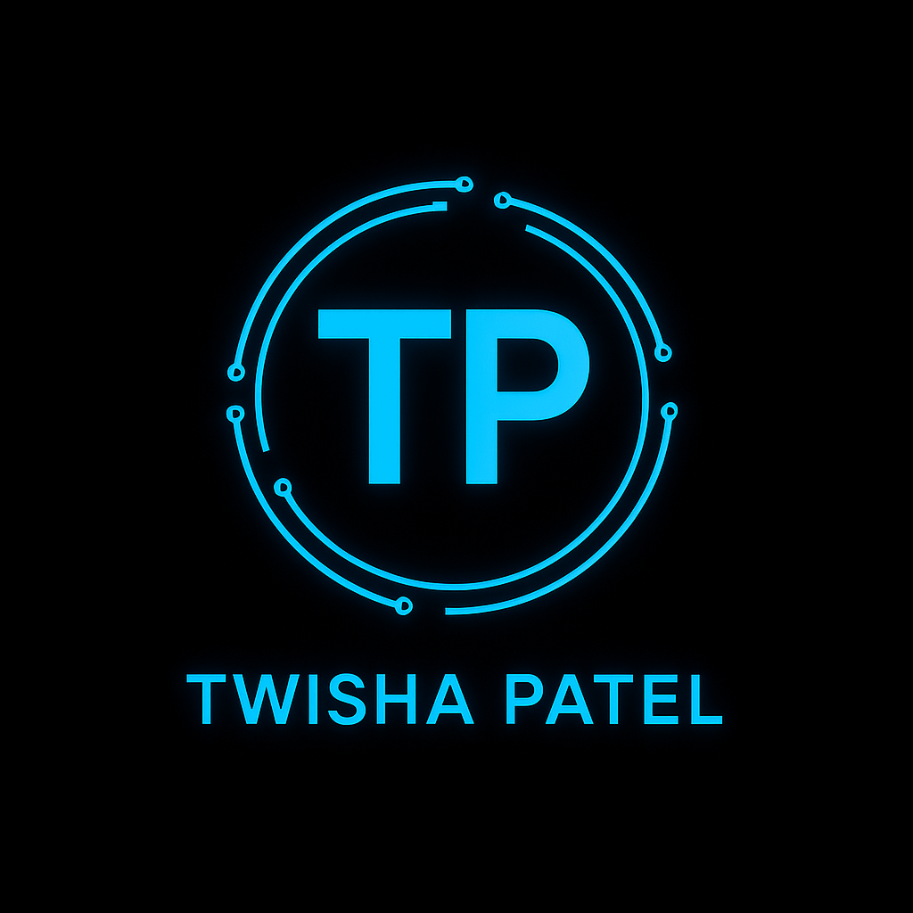

   <h1 align="center">Hello, I'm Twisha Patel!</h1>
   
  <!-- -->
  
  

---

<h3 align="center">🚀 <strong>AI/ML Engineer | LLMs & Automation | Deep Learning | MLOps</strong></h3>

---

<h2 align="center">⚙️ Skills & Technologies</h2>

  <!-- Programming Languages & DB -->
  
  
  
  
   
  <!-- Web & Version Control -->
  
  
  
  
  
   
  <!-- ML/DL/AI Tools -->
  
  
  
  
   
  <!-- Specialties & Frameworks -->
  
  
  
  
  
   
  <!-- Advanced & Modern AI -->
  
  
  

---

<h2 align="center">💼 Professional Experience</h2>

  <ul type="none">
    <li>🔹 <strong>AI/ML Intern</strong> @ Artem HealthTech <em>(Jan 2025 – July 2025)</em></li>
    <li>🔹 <strong>Web Development & Design Intern</strong> @ Oasis Infobyte <em>(Sept 2023 – Oct 2023)</em></li>
    <li>🔹 <strong>Web Development Intern</strong> @ Acmegrade <em>(Sept 2023 – Nov 2023)</em></li>
    <li>🔹 <strong>Full Stack Web Developer Intern</strong> @ Slashmark Internship <em>(Nov 2023 – Feb 2024)</em></li>
    <li>🔹 <strong>Full Stack Web Developer Intern</strong> @ Business Web Solutions <em>(Dec 2023 – Mar 2024)</em></li>
  </ul>

---

<h2 align="center">🧩 Projects</h2>

<b>AutoML Pipeline Service</b>

<ul>
  <li>Streamlit & FastAPI pipeline for dynamic ML model training, inference & benchmarking</li>
  <li>Automated dataset profiling, model selection, versioning, and logging</li>
  <li>Web UI for config, deployment & visualization</li>
  <li>Tech: Python, Streamlit, FastAPI, scikit-learn, Docker</li>
</ul>

<b>Object Detection (RTMDet-tiny)</b>

<ul>
  <li>Real-time object detection using MMDetection & OpenCV (webcam live feed)</li>
  <li>Bounding boxes & class labels (COCO weights)</li>
  <li>Tech: Python, MMDetection, OpenCV</li>
</ul>

<b>Traffic Sign Recognition</b>

<ul>
  <li>CNN model for German traffic sign classification (TensorFlow & Keras)</li>
  <li>OpenCV preprocessing & augmentation for robustness</li>
  <li>Tech: Python, TensorFlow, OpenCV, Keras</li>
</ul>

<b>Finance-based Small LLM</b>

<ul>
  <li>Fine-tuned Flan-T5 LLM on finance Q&A</li>
  <li>Prompt engineering for contextual accuracy</li>
  <li>Tech: Python, Hugging Face, Flan-T5</li>
</ul>

<b>Voice Assistant</b>

<ul>
  <li>Desktop voice assistant (Python): reminders, music, web, info & more</li>
  <li>Speech recognition & TTS integration</li>
  <li>Tech: Python, SpeechRecognition, pyttsx3</li>
</ul>

---

<h2 align="center">📊 GitHub Stats</h2>

  
   
  
   
  

---

<h2 align="center">📫 Connect with Me</h2>

  
  
  

---

  <b>"Building intelligent solutions, one model at a time."</b> 
  &copy; 2024 Twisha Patel

